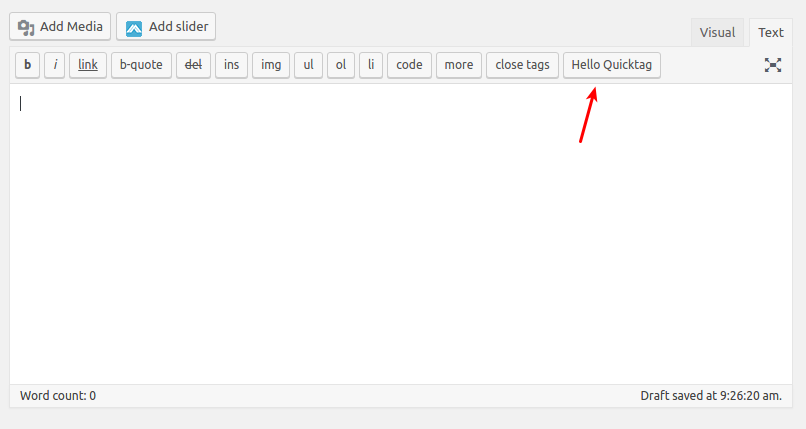

# Hello Quicktags Plugin

Hello Quicktag is a plugin sample of WordPress to insert a simple tag button in the editor.

### How To

To create quicktags on the WordPress, only need some functions basically:

Is necessary add an action to `admin_print_footer_scripts`, witch will include the Javascript to manipulate textareas.

Use the Javascript functions, `QTags.addButton`, provided by WordPress to add the new button on top of the text field, and call the `QTags.insertContent` to insert content into the text field.

As is Javascript, you can feel free to manipulate the content and insert what ever you want to the field.

### Please don't use it!